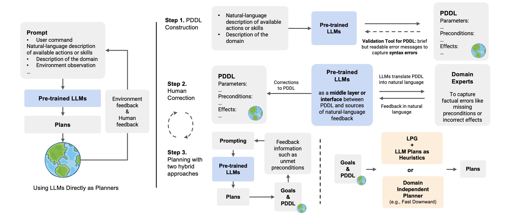

# (NeurIPS 2023) Leveraging Pre-trained Large Language Models to Construct and Utilize World Models for Model-based Task Planning

Python implementation of the paper: [Leveraging Pre-trained Large Language Models to Construct and Utilize World Models for Model-based Task Planning](https://guansuns.github.io/pages/llm-dm).

**Update: The paper has been accepted to NeurIPS 2023.**

**Note**: The code has been refactored for better readability. If you encounter any problem, feel free to email lguan9@asu.edu.

<p align="center">
  
</p>

### Step 0. Env Setup
- Install dependencies
```
conda create -n llm-pddl python=3.11
conda activate llm-pddl
pip install -r requirements.txt
```
- Config OpenAI API key: put your key under `config/api_config.json`

### Step 1. Generate World (Domain) Models

To leverage an LLM to construct a domain model, you need to provide the following information:
- Natural language descriptions of all the actions. Example: `prompts/logistics/action_model.json`.
- A description of the domain. Example: `prompts/logistics/domain_desc.txt`.
- Information of the object types and hierarchy. Example: `prompts/logistics/hierarchy_requirements.json`.

Then, in the script `construct_action_models.py`, specify the domain and the LLM model (and other configurations if needed). When this script is executed, the LLM will generate PDDL models for all actions in turn. As mentioned in the paper (Appendix), we have implemented a simple PDDL syntax validator (`pddl_syntax_validator.py`) in Python. Although it doesn't comprehensively cover all possible errors in PDDL, we found it sufficient to correct almost all basic syntax errors in models generated by GPT-4.

The experiment record, the generated PDDL model and the translated PDDL will be saved under the directory `results/{domain}/model_blocksworld/` (note: `model_blocksworld` means that the default prompt uses the Blocksworld as examples). Then the domain expert can inspect the action models and provide corrective feedback as needed. The feedback messages should be provided under the `annotation` list of each action in the file `{llm-model}_pddl_for_annotations.json`.

### Step 2. Correct World (Domain) Models

While it may be easy for PDDL experts to directly inspect and correct the generated PDDL models, we cannot assume that all end users possess this level of expertise. The script `correct_action_models.py` implements a pipeline that involves reading natural language feedback in `{llm-model}_pddl_for_annotations.json`, replaying and continuing the PDDL-construction dialogue, and obtaining the corrected domain model from the LLM. Similar to the generation script, here we need to specify the domain and the LLM model (and other configurations if needed). The experiment record, the final PDDL model and the final predicate list will be saved under the sub-directory `corrected`.

**Note**: Step 1 and Step 2 are the core components of the solutions discussed in the original paper.

**Examples**: We provide the constructed models for two IPC domains (i.e., logistics and tyreworld) as examples (the results were obtained on 06/03/23). The experiment records and models are located in the `results` directory.


### Step 3. Plan Generation

To support future research, we are sharing the test samples for the household domain, which can be found in `experiments/planning_tasks/household_planning_tasks.json`. Each test case comprises an instruction and a list of object states. For an example of how to read each test case, please refer to `experiments/planning_tasks/example_task_reader.py`.

The code for converting a list of object states into a PDDL problem file is not included here. In our experiment, we simply hard coded a script to prepare PDDL problem files based on a manually-defined mapping between object states here and predicates generated by GPT-4. This process could be automated with language models.

For the logistics domain, the parsed problem instances can be found in `experiments/planning_tasks/logistics_planning_tasks.json`. A copy of the original IPC domain and problem files (for the logistics domain) can be found in `experiments/planning_tasks/raw_pddl_problems/logistics/`.
